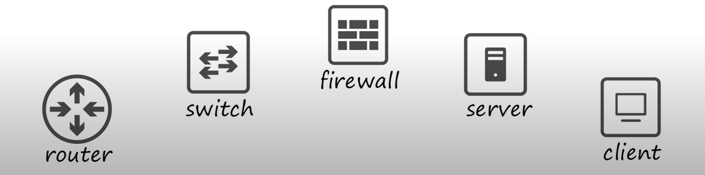
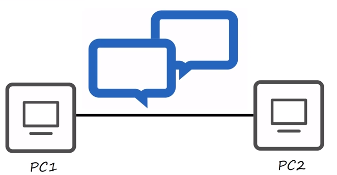
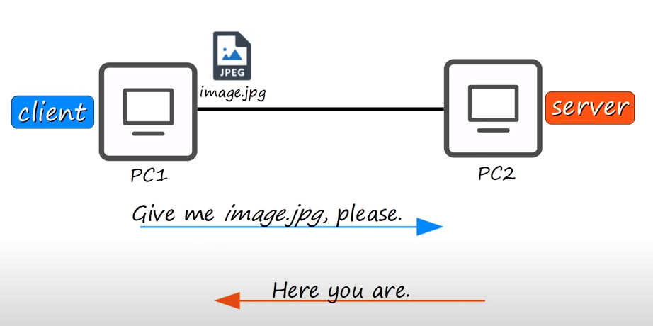
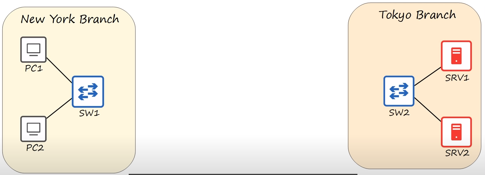
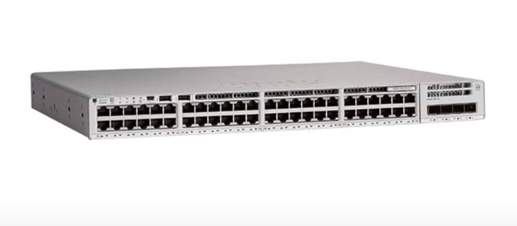
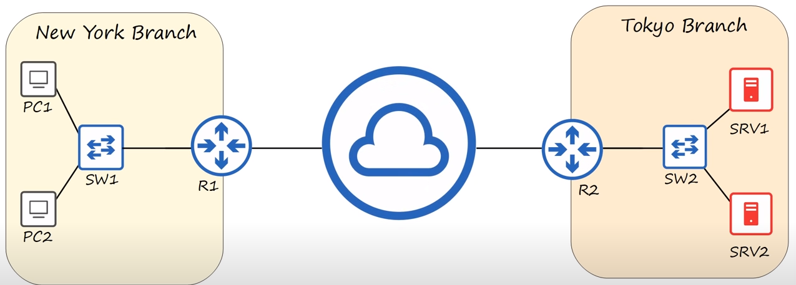
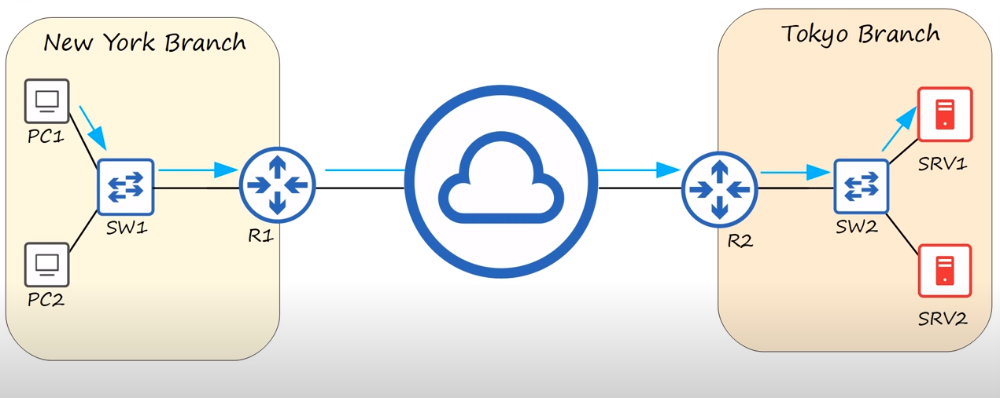
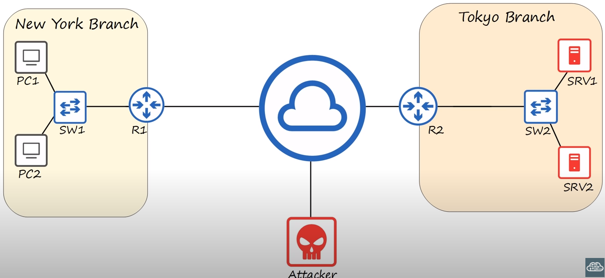
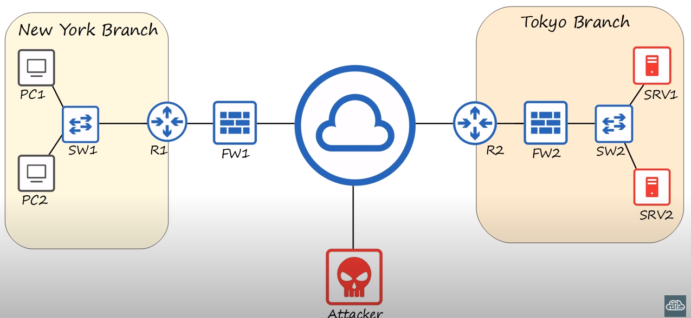
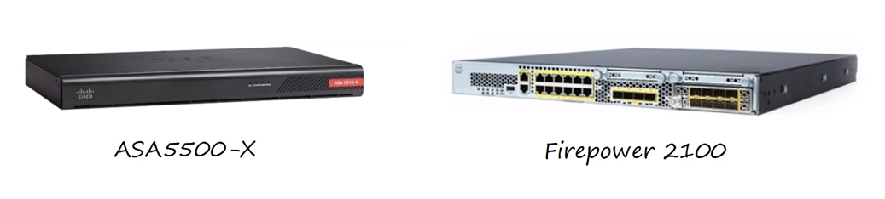

# Network
### What is computer network:
##### Computer network is a digital telecommunications network which allows nodes to share resources.
### What are the nodes:
#### Router, switch, firewall, server and client

### Lets think 2 client connect to eachother and they can communicate so we have a very basic network :)

### What is client
#### A client is a device that accesses a service made available by a server.
### What is server
#### A server is a device that provides functions or services for clients.
#### Here is some server examples. You can see rows and rows of them in data centers :)

### A server-client relation

#### A note: the same device can be a client in some situations, and a server in other situations.
### Switches
#### Typically you don't connect end host like PCs or servers directly to each other. You aggregate to connections to a device called a switch.
#### As you can see, the two PCs are connected to switch1 and the two servers are connected to switch2

#### Switches have lots of interfaces for you to connect end hosts to.
#### Look at this Cisco Catalyst switch. As you can see lots of interfaces or ports to plug your PCs or servers into.

#### Switches cannot connect directly to the internet and send data between two LANs.
#### It provides connectivity to hosts within the same LAN(Local Area Network)
#### It cannot provide connectivity between LANs or over the Internet. To do so we need another kind of device.That devices are Routers.
### Router
#### We can connect the switched to routers like this and then connect the routers to the internet.

#### Lets think PC1 in the New York Branch want to communicate with Server1 in the Tokyo Branch.
#### It will send the request to R1(router 1) via SW1(switch 1) which will forward it over the internet to R2(router 2), which will then send it to Server1 via SW2(switch 2).

#### The reply will foloow the reverse path back to PC1.
#### Routers have fewer network interfaces than switches.
#### Also, remember that switches are used to forward data within a LAN. Routers do the opposite.
#### Routers are used to provide connectivity between LANs.
#### It is therefore used to send data over the internet.
### Firewalls
#### Here is our network one again, but this time there is a difference. There is an attacker somewhere in the internet with an arsenal of many ways he could attack.

#### What we sould really be using to protect our network is using firewall.

#### Firewalls are specialty network security devices that control network traffic, entering and exiting your network.
#### Firewalls can be placed outside of your router like FW1 or inside of your network like FW2.
#### Here is some firewalls picture.

